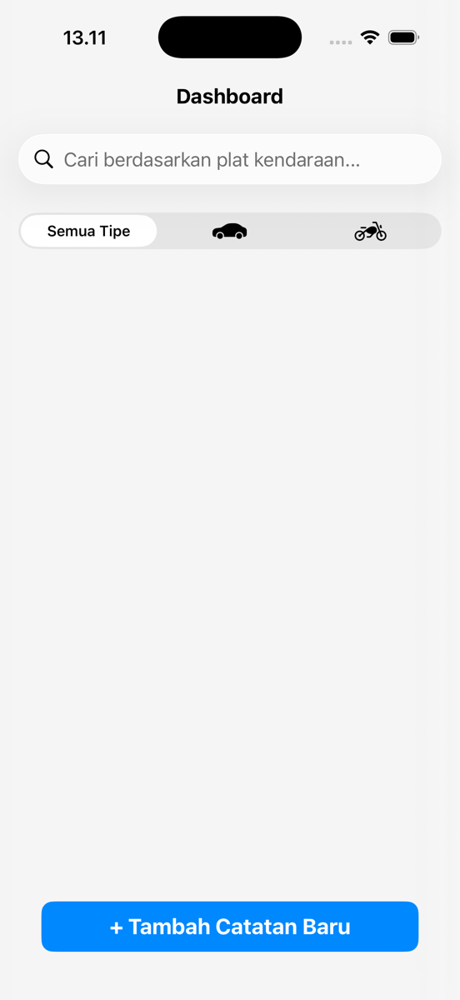

# GOAT — Vehicle Incident Logbook (CCL1-25)

*A SwiftUI logbook for vehicle incidents, keyed by license plate and fed by a live camera scanner.*

Picture the desk at a parking garage or a building's security post: something happens to a vehicle — illegal parking, a scratch, a lost item — and someone needs to write it down against *that* car, findable again next week. GOAT is that logbook as an iOS app. Every record ("catatan") is tied to a license plate: scan the plate with the camera or type it in, attach a photo, pick a category, and add a note. All data stays on-device with SwiftData, and the UI is in Indonesian.



*The dashboard on first launch: plate search, an all/car/motorcycle type filter, and the "+ Tambah Catatan Baru" button that starts a new record.*

## The idea

A plate number is the one identifier everyone at the scene can see, so it is the primary key of the whole app. The dashboard groups vehicles by the date of their most recent activity, so the newest cases surface first; each vehicle card shows the plate, the latest category and note, and a relative time. Tap through and you get that vehicle's complete, filterable history.

## How a record gets made

The new-entry flow collects a plate (typed or scanned), a vehicle type (car or motorcycle), a photo from the camera or photo library (PhotosPicker and `UIImagePickerController`), a category, and a free-text note — saving is disabled until the required fields are filled.

The scanner is the shortcut. The AVFoundation camera feed is processed frame-by-frame with Vision's `VNRecognizeTextRequest`, and a confirmation dialog hands the detected plate to the entry form or the search field — the dashboard supports searching by plate number, including scan-to-search. If the plate already belongs to a known vehicle, the new entry is appended to that vehicle's history rather than creating a duplicate.

## Living with the history

The vehicle detail view is where records are worked with after the fact: entry history grouped by day, text search across categories and notes, date-range filtering, inline editing of the plate and vehicle type, and swipe-to-delete with a guard when removing a vehicle's last entry.

## Data model

Two SwiftData models carry everything: `Car` (plate, type) with a one-to-many relationship to `Entry` (category, timestamp, note, optional image). Persistence is entirely on-device.

## Under the hood

Swift and SwiftUI, SwiftData for persistence, Vision (`VNRecognizeTextRequest`) for plate text recognition, AVFoundation for the live camera preview and frame capture, and PhotosUI / UIKit interop for photo attachment.

```
CCL1-25GOAT/
  CCL1_25GOATApp.swift          App entry point + SwiftData models (Car, Entry)
  DashboardView.swift           Date-grouped vehicle list, search, vehicle-type filter
  PlateScannerView.swift        Camera preview + per-frame Vision OCR + confirm dialog
  AddNewEntryView.swift         New record form: scan, photo (camera/gallery), category, note
  VehicleDetailView.swift       Per-vehicle history with search, date filter, editing, deletion
  FilterView.swift              Date-range filter sheet
  VehicleTypeFilterView.swift   Car/motorcycle filter control
  EditPlateView.swift           Plate editing
  DeleteConfirmationView.swift  Delete confirmation dialog
  CustomSearchBar.swift         Search bar component
```

## Running it

Open `CCL1-25GOAT.xcodeproj` in Xcode, then build and run. Use a physical iPhone to test the plate scanner and camera capture; the rest of the app works in the simulator.
